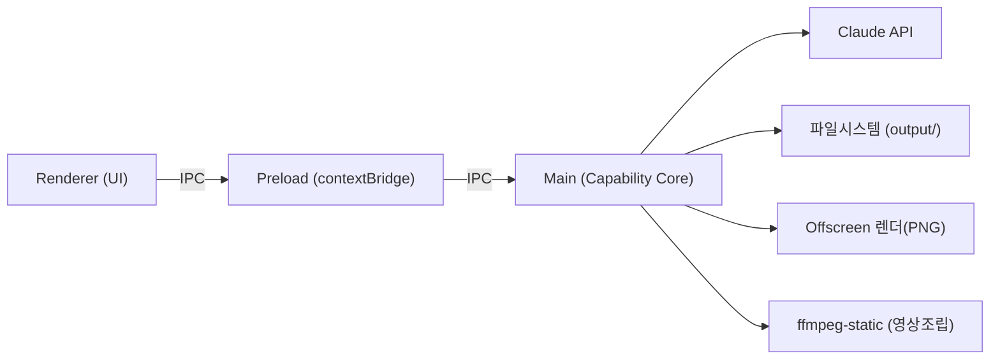

# Architecture Spine — SNS 콘텐츠 제작 자동화 도구

## Design Paradigm

**Electron 2-Process Boundary**: Main 프로세스가 모든 능력(파일시스템, Claude API, 렌더링, ffmpeg)을 소유하는 Capability Core이고, Renderer 프로세스는 순수 UI(웹뷰 미리보기, contenteditable, 코드창)만 담당하는 Presentation Shell. 둘 사이는 IPC(contextBridge)로만 통신.

내부적으로 Main이 소유한 자산 처리는 **Pipes-and-Filters 파이프라인**: 참고이미지 → (Claude) HTML 생성 → 편집 → (offscreen render) PNG → (ffmpeg) 영상조립 → (Claude) 원고생성. 각 단계는 독립적으로 재실행 가능(예: 재생성 버튼).



## Invariants & Rules

### AD-1 — Main/Renderer 권한 분리 [ADOPTED]
- **Binds:** all
- **Prevents:** Renderer가 Node API/파일시스템/API 키에 직접 접근해 보안경계가 흐려지는 것
- **Rule:** Renderer는 `nodeIntegration: false`, `contextIsolation: true`로 실행. 파일시스템·Claude API·렌더링·ffmpeg 호출은 전부 Main에서만 수행하고 Renderer는 IPC로만 요청한다.

### AD-2 — 정보카드 HTML 구조 계약
- **Binds:** FR-1, FR-2, FR-3, FR-4, FR-5, FR-9
- **Prevents:** 카드마다 HTML 구조가 달라져 클릭→코드 동기화, 색상변수, ffmpeg 전환효과가 깨지는 것
- **Rule:** 모든 정보카드 HTML은 고정 골격 계약을 지켜야 한다 — (1) 제목바/불릿박스/아이콘/푸터 영역마다 `data-edit-id` 부여, (2) 색상은 `:root` CSS 커스텀 프로퍼티로만 표현(하드코딩 금지), (3) 카드 1장 = 단일 HTML 파일. 골격 내부의 실제 비주얼(아이콘 모양, 불릿 스타일, 배치)은 Claude가 참고이미지 기반으로 자유 생성하되 위 계약은 시스템 프롬프트로 강제한다.

### AD-3 — 렌더 엔진 단일화
- **Binds:** FR-2, FR-3, FR-4
- **Prevents:** 미리보기 화면과 실제 PNG 출력이 서로 다른 렌더링 엔진을 써서 결과가 미묘하게 달라지는 것
- **Rule:** HTML→PNG 변환은 Playwright 등 별도 Chromium을 추가하지 않고 Electron 자체 offscreen `BrowserWindow` + `capturePage()`만 사용한다. 미리보기와 동일 엔진.

### AD-4 — 카드 모션그래픽은 HTML/CSS 애니메이션 프레임캡처로 구현
- **Binds:** FR-5, FR-6
- **Prevents:** 카드 내부 요소(불릿/아이콘 등)의 실제 모션을 정적 이미지 전환효과로 대체해 시각적으로 다른 결과물이 나오는 것
- **Rule:** 프레임레이트는 60fps로 고정한다. 실시간 재생을 화면캡처하지 않고, 결정론적 프레임스테핑(애니메이션 타임라인을 1/60초 단위로 강제 정지·전진시키며 매 스텝마다 `capturePage()` 호출)으로 캡처해 렌더링 소요시간과 무관하게 항상 정확한 60fps 시퀀스를 만든다. 카드에 반복(루핑) 모션그래픽이 있을 수 있어 정지 구간을 가정하지 않고, 노출시간 전체(진입 애니메이션 + 추가노출 3초)를 빠짐없이 프레임캡처한다. 프레임 PNG 시퀀스는 ffmpeg 인코딩 후 임시파일로 삭제하고 최종 산출물(mp4)만 남긴다. ffmpeg는 프레임 시퀀스+오디오 조립에만 사용하고, 카드 간 전환 자체에 별도 `xfade` 효과를 적용하지 않는다(다음 카드의 자체 진입 애니메이션이 전환 역할을 한다). 이 파이프라인은 Claude API를 호출하지 않는다(로컬 렌더링, 토큰비용 없음).

### AD-5 — 상태는 파일시스템이 단일 진실 소스
- **Binds:** FR-8, all
- **Prevents:** 별도 DB와 파일시스템 간 상태 불일치
- **Rule:** DB를 두지 않는다. `output/{키워드}/{YYMMDD}/`가 콘텐츠 산출물의 단일 진실 소스이고, 음악 로테이션 마지막 사용곡 등 도구 자체 상태는 Electron `app.getPath('userData')` 하위 JSON 파일로만 추적한다.

### AD-6 — API 키 보관
- **Binds:** FR-1, FR-7
- **Prevents:** 평문 키 노출, 멀티PC 동기화로 인한 불필요한 복잡도
- **Rule:** Claude API 키는 Electron `safeStorage`(OS 암호화)로 `userData` 폴더에 저장한다. 동기화 기능은 만들지 않는다 — PC 변경 시 설정화면에서 재입력.

### AD-7 — 파일 네이밍 단일 유틸
- **Binds:** FR-4, FR-6, FR-8
- **Prevents:** 이미지/영상/HTML 저장 시 각 모듈이 제각각 파일명을 조립해 규칙이 어긋나는 것
- **Rule:** `{YYMMDD}_{키워드}_{카드순번 2자리}.png`/`.html`(카드 단위)와 `{YYMMDD}_{키워드}.mp4`(영상)는 `storage/naming.ts` 한 곳에서만 생성한다. 다른 모듈은 이 유틸을 호출만 한다.

## Consistency Conventions

| Concern | Convention |
| --- | --- |
| Naming (entities, files, interfaces, events) | 파일/폴더는 AD-7 네이밍 유틸 경유. IPC 채널명은 `domain:action` 형식(예: `card:generate`, `video:render`). |
| Data & formats (ids, dates, error shapes, envelopes) | 날짜는 `YYMMDD`(파일명) / ISO 8601(로그·상태파일). IPC 응답은 `{ ok: boolean, data?, error?: { message } }` 봉투 고정. |
| State & cross-cutting (mutation, errors, logging, config, auth) | 모든 쓰기(파일/상태)는 Main에서만. 에러는 IPC 응답 envelope으로 Renderer에 전달 + Main에서 `userData/logs/`에 로컬 로그 적재. 원격 로깅/텔레메트리 없음. |

## Stack

| Name | Version |
| --- | --- |
| Electron | ^42 (stable, 2026-06 기준) |
| electron-vite | latest (main/preload/renderer 빌드 도구, 공식 권장) |
| TypeScript | ^5 |
| Node.js | >=22.12 |
| electron-builder | ^26 (NSIS 타깃) |
| @anthropic-ai/sdk | latest (Node) |
| ffmpeg-static | latest |

## Structural Seed

```text
src/
  main/
    api/            # Claude API 클라이언트 래퍼 (HTML생성, 원고생성)
    render/         # offscreen BrowserWindow → PNG, ffmpeg 영상조립
    storage/        # output 폴더 관리, naming.ts, 음악로테이션 상태
    ipc/            # ipcMain 핸들러 (domain:action 채널)
  preload/          # contextBridge로 노출되는 타입드 API 표면
  renderer/         # 에디터 UI: 미리보기(webview+contenteditable), 코드창, 설정화면
  templates/        # 정보카드 HTML/CSS 골격 계약(AD-2) + 시스템 프롬프트
  shared/           # Main/Renderer 공유 타입 (IPC 계약)

{userData}/
  settings.json     # API 키(safeStorage 암호화), 환경설정
  music-state.json  # 마지막 사용 음악 트랙 추적
  logs/

output/{키워드}/{YYMMDD}/
  meta.json         # 키워드, 제목, 홈페이지 URL (썸네일 등록 시 입력, FR-7 원고생성이 읽어감)
  html/             # 예: 260625_haion망분리_01.html
  image/            # 예: 260625_haion망분리_01.png
  video/            # {YYMMDD}_{키워드}.mp4
  원고.txt
  thumbnail.*        # 수동 등록 썸네일 원본
```

## Capability → Architecture Map

| Capability / Area | Lives in | Governed by |
| --- | --- | --- |
| FR-1 참고이미지→HTML 생성 | `main/api/`, `templates/` | AD-2 |
| FR-2/FR-3 인라인편집+코드창 동기화 | `renderer/`, `templates/` (data-edit-id) | AD-2, AD-1 |
| FR-9 자연어 AI 편집 | `main/api/`(FR-1과 동일 클라이언트 재사용), `renderer/` | AD-2, AD-1 |
| FR-4 HTML→PNG 렌더링 | `main/render/` | AD-3, AD-7 |
| FR-5 모션그래픽 | `main/render/` (ffmpeg 단계) | AD-4 |
| FR-6 음악로테이션 영상조립 | `main/render/`, `main/storage/` | AD-4, AD-5, AD-7 |
| FR-7 원고생성 | `main/api/` | AD-6 |
| FR-8 출력폴더/메타데이터 | `main/storage/` | AD-5, AD-7 |

## Deferred

- 업로드 기록 엑셀화, 4사 업로드 자동화 — PRD §5/§6.2 Non-Goal, 이번 아키텍처 범위 아님.
- 카드 골격 계약(AD-2)의 정확한 `data-edit-id` 스키마와 색상 변수 명명 규칙 세부 — 에픽/스토리 단계에서 확정.
- 자동 업데이트, 원격 로깅/모니터링 — 1인 도구 특성상 의도적으로 범위 제외(재검토 조건: 다중 PC/다중 사용자로 확장될 때).
